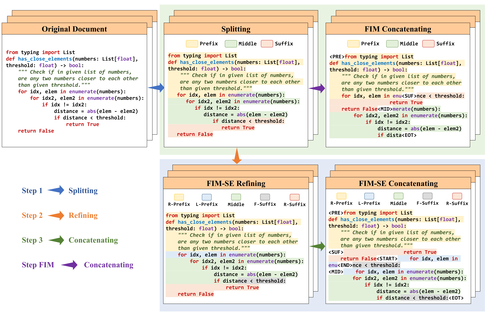

## Empowering Character-level Text Infilling by Eliminating Sub-Tokens

<p align="center">
    <a href="https://arxiv.org/abs/2405.17103">📄 Paper</a> •
    <a href="https://github.com/SenseLLM/FIM-SE">🏠 Repo</a> •
    <a href="https://huggingface.co/SenseLLM/FIM-SE-CL-13B">🤖 Models</a>
</p>

## Introduction
FIM-SE stands for Fill-In-the-Middle with both Starting and Ending character constraints. The proposed method addresses character-level infilling tasks by utilizing a line-level format to avoid predicting any sub-token in inference.



## Models

| Model | Checkpoint | Size | License|
|:------|:-----------|:-----|:-------|
| FIM-SE-CL-7B   | 🤗 [HF Link](https://huggingface.co/SenseLLM/FIM-SE-CL-7B)  | 7B  | [Llama2](https://ai.meta.com/llama/license/) |
| FIM-SE-CL-34B  | 🤗 [HF Link](https://huggingface.co/SenseLLM/FIM-SE-CL-34B) | 13B | [Llama2](https://ai.meta.com/llama/license/) |
| FIM-SE-SC-1B   | 🤗 [HF Link](https://huggingface.co/SenseLLM/FIM-SE-SC-1B)  | 1B  | [StarCoder](https://github.com/bigcode-project/starcoder/blob/main/LICENSE) |
| FIM-SE-SC-15B  | 🤗 [HF Link](https://huggingface.co/SenseLLM/FIM-SE-SC-15B) | 15B | [StarCoder](https://github.com/bigcode-project/starcoder/blob/main/LICENSE) |

## Training and Evalutation

### Data Structure

Refine your data into a JSON Line file, e.g., data/sample.jsonl, ensuring that each line contains a single key named "text," with its corresponding value being a snippet of code.

```json
{
    "text": "package body Bubble with SPARK_Mode is\n  \n  procedure Sort (A : in out Arr) is\n    Tmp : Integer;\n  begin\n    Outer: for I in reverse A'First .. A'Last - 1 loop\n      Inner: for J in A'First .. I loop\n        if A(J) > A(J + 1) then\n          Tmp := A(J);\n          A(J) := A(J + 1);\n          A(J + 1) := Tmp;\n        end if;\n        \n        pragma Loop_Invariant (for all K1 in A'Range => (for some K2 in A'Range => A(K2) = A'Loop_Entry(Inner)(K1)));\n        \n      end loop Inner;\n      \n      pragma Loop_Invariant (for all K1 in A'Range => (for some K2 in A'Range => A(K2) = A'Loop_Entry(Outer)(K1)));\n      \n    end loop Outer;\n  end Sort;  \n\nend Bubble;\n"
}
```

### Pre tokenize

Taking Codellama as an example, use the following command to pre-tokenize. 

Note that the vanlliz Code Llama tokenizer will add a space at the beginning, which is not conducive to post-processing of the completion model. Therefore, we modified the native tokenizer and its path is "data/codellama_fimse".

```shell
python train.py \
--save_cache \
--train_file data/sample.jsonl \
--tokenizer_cfg data/codellama_fimse \
--output_dir runs/fim_se_cache 
```

### Training

```shell
RANK=...
MASTER_ADDR=...
MASTER_PORT=...
WORLD_SIZE=...

# the saved cache, for example, runs/fim_se_cache/cache of previous command
cache_dir=... 

torchrun --nnodes ${WORLD_SIZE} --node_rank ${RANK} --master_addr ${MASTER_ADDR} --master_port ${MASTER_PORT} --nproc_per_node 8 train.py  --model_cfg codellama/CodeLlama-7b-hf --tokenizer_cfg data/codellama_fimse --max_len 16384 --deepspeed config/stage_1.json --output_dir runs/fim_se_codellama_7b --per_device_train_batch_size 1 --gradient_accumulation_steps 8 --adam_beta1 0.9 --adam_beta2 0.95 --weight_decay 0.1 --learning_rate 3e-5 --lr_scheduler_type cosine --max_steps 5000 --save_steps 1000 --logging_steps 10 --seed 3407 --report_to tensorboard --dataloader_num_workers 8 --remove_unused_columns false --bf16 --do_train --save_only_model --save_safetensors --gradient_checkpointing --train_file ${cache_dir} --load_cache
```

### Testing

```shell
python test.py --task all --method fim_se --token_mode llama --model_cfg runs/fim_se_codellama_7b/checkpoint-5000
```

## Citation

If you find this repo useful for your research, please kindly cite our paper:
```
@misc{ren2024empowering,
    title={Empowering Character-level Text Infilling by Eliminating Sub-Tokens}, 
    author={Houxing Ren and Mingjie Zhan and Zhongyuan Wu and Hongsheng Li},
    year={2024},
    eprint={2405.17103},
    archivePrefix={arXiv},
    primaryClass={cs.CL}
}
```

## Acknowledgments

We thank the following amazing projects that truly inspired us:

- [FIM](https://arxiv.org/abs/2207.14255)